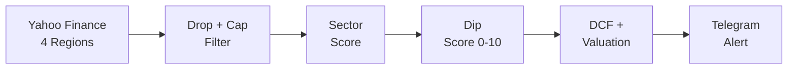

# 📡 DipRadar
> **Global dip hunter & Telegram alert bot — sector-aware, score-filtered.**

[](https://www.python.org/)
[](https://core.telegram.org/bots)
[](https://railway.app/)
[](https://finance.yahoo.com/)

---

### 💡 The Vision
**DipRadar** monitors **US, Europe, UK and Asia** markets simultaneously for sharp daily selloffs in quality companies. It filters every dip through a two-layer system — qualitative sector analysis + quantitative score — and delivers actionable Telegram alerts with DCF valuation, news context and RSI signal.

### 🚀 At a Glance
- 🌍 **Global Screening**: US + Europe + UK + Asia via Yahoo Finance (free, no API key)
- 💰 **Market Cap Filter**: Only $2B+ companies (no penny stocks)
- 🎯 **Sector Precision**: 11 sectors with custom thresholds (Tech vs. Utilities vs. REITs)
- 📊 **Quantitative Score**: 0–10 score per dip (FCF, growth, margins, RSI, D/E)
- 📈 **Valuation Layer**: Simplified DCF + WACC by sector + Margin of Safety
- 🔔 **Three Verdicts**: COMPRAR 🟢 / MONITORIZAR 🟡 / EVITAR 🔴
- 📰 **News Context**: Latest 3 headlines per alert
- ⏰ **Daily Summaries**: Opening (+1h at 15:30) and Close (+15min at 21:15) Lisbon time

---

### ⚙️ How It Works

```
1. Every 30min → Yahoo Finance screener (US + Europe + UK + Asia)
2. Filter: drop ≥8% + market cap ≥$2B + no ETFs
3. score_fundamentals() → COMPRAR / MONITORIZAR / EVITAR (qualitative)
4. calculate_dip_score() → 0–10 score (quantitative)
5. if score < MIN_DIP_SCORE → skip
6. Telegram alert with: region, sector, score badge, RSI,
   P/E vs historical, FCF yield, DCF intrinsic, analyst target, news
7. 15:30 → opening summary (Tier 1 candidates)
8. 21:15 → close summary (Tier 1 + Tier 2 with 52w drawdown)
```



---

### 📊 Quantitative Score System

Each dip gets scored 0–10 based on objective criteria:

| Criterion | Points | Logic |
| :--- | :---: | :--- |
| FCF Yield > 5% | **+3** | Cash-generative business |
| Revenue Growth > 10% | **+2** | Growing top line |
| Gross Margin > 40% | **+2** | Premium economics |
| RSI < 30 | **+2** | Technically oversold |
| Debt/Equity < 1 | **+1** | Clean balance sheet |

**Score badges in alerts:**
- 🔥 `Score: 8–10` → Top tier gem
- ⭐ `Score: 6–7` → Strong candidate
- 📊 `Score: 4–5` → Monitor closely

---

### 📊 Sector Intelligence

| Sector | Key Metrics | Red Flags |
| :--- | :--- | :--- |
| 💻 **Technology** | FCF Yield, Growth, Gross Margin | FCF negativo, Revenue decline |
| 🏥 **Healthcare** | R&D Pipeline, FCF Yield | FDA rejection, Patent cliff |
| 🏦 **Financials** | P/B, ROE, NIM | Credit losses rising |
| 🛍️ **Consumer Cyclical** | Same-store sales, Inventory | SSS negativo, Margin compression |
| 🛒 **Consumer Defensive** | Dividend growth, Pricing power | Dividend cut |
| 🏭 **Industrials** | Backlog, FCF Yield | Backlog decline |
| 🏢 **Real Estate** | FFO Yield, Occupancy | Occupancy falling |
| ⚡ **Energy** | FCF at $60 oil, Dividend | FCF negativo a $60 barril |
| 📡 **Communication** | Subscriber growth, ARPU | Subscriber loss |
| 💡 **Utilities** | Dividend yield, Rate base | Regulatory adverso |
| 🪨 **Materials** | FCF Yield, Cost curve | Commodity collapse |

---

### 📱 Sample Telegram Alert

```
📉 CHTR — Charter Communications (US)
Queda: -25.5% | 52w: -42%
💰 Preço: $250 | 🏦 Cap: $30.1B
🏢 Sector: 📡 Comunicação
🔥 Score: 8/10 | RSI: 28

🟢 Veredito: COMPRAR
  P/E 12.1x — 25%+ abaixo do justo (20x) para o sector
  FCF yield 6.2% — muito atrativo

📊 Fundamentos:
  • P/E: 12.1x vs hist. 22.0x (-45%)
  • FCF Yield: 6.2%
  • DCF intrínseco: $320.4 (margem: +28%)
  • EV/EBITDA: 7.2x
  • Revenue growth: 4.1%
  • Gross margin: 47.3%
  • Target analistas: $310.0 (+24%)

📰 Notícias:
  [Charter beats Q1 earnings estimates...](url) Reuters
  [Cable giant cuts capex guidance...](url) Bloomberg

⏰ 27/04 15:42
```

---

### 📦 Project Structure

| File | Role |
| :--- | :--- |
| `main.py` | Engine: scheduler, scan loop, Telegram delivery |
| `market_client.py` | Data: global screener (4 regions), fundamentals, RSI |
| `sectors.py` | Logic: 11-sector qualitative scoring (COMPRAR/MONITORIZAR/EVITAR) |
| `score.py` | Score: quantitative 0–10 dip quality score |
| `valuation.py` | Insight: DCF, WACC by sector, Margin of Safety |
| `railway.toml` | Deploy: Railway production config |
| `requirements.txt` | Dependencies |

---

### 🛠️ Setup

**1. Clone & Install**
```bash
git clone https://github.com/romeurf/DipRadar.git
cd DipRadar
pip install -r requirements.txt
```

**2. Telegram Bot**
- Fala com `@BotFather` → `/newbot` → copia o **token**
- Vai a `https://api.telegram.org/bot<TOKEN>/getUpdates` → copia o `chat.id`

**3. Deploy Railway**
```bash
# 1. railway.app → New Project → Deploy from GitHub repo
# 2. Variables → adiciona:
```

| Variable | Required | Default | Description |
| :--- | :---: | :---: | :--- |
| `TELEGRAM_TOKEN` | ✅ | — | Bot token do @BotFather |
| `TELEGRAM_CHAT_ID` | ✅ | — | Chat ID do teu Telegram |
| `TZ` | ✅ | — | `Europe/Lisbon` |
| `DROP_THRESHOLD` | ☑️ | `8` | % queda mínima (Tier 1) |
| `MIN_MARKET_CAP` | ☑️ | `2000000000` | Cap mínimo em $ |
| `SCAN_EVERY_MINUTES` | ☑️ | `30` | Frequência dos scans |
| `MIN_DIP_SCORE` | ☑️ | `5` | Score mínimo 0–10 para alertas |

**Tuning do `MIN_DIP_SCORE`:**
- `3–4` → Agressivo (mais alertas, menos filtrado)
- `5` → **Recomendado** (balanço qualidade/quantidade)
- `6–7` → Conservador (só gems com múltiplos critérios)
- `8+` → Muito seletivo (raros, mas top tier)

---

### ⚠️ Disclaimer
*DipRadar is a screening and research tool. It does not provide financial advice. DCF/WACC models are simplified for fast triage, not institutional-grade valuation. Always do your own research before investing.*
